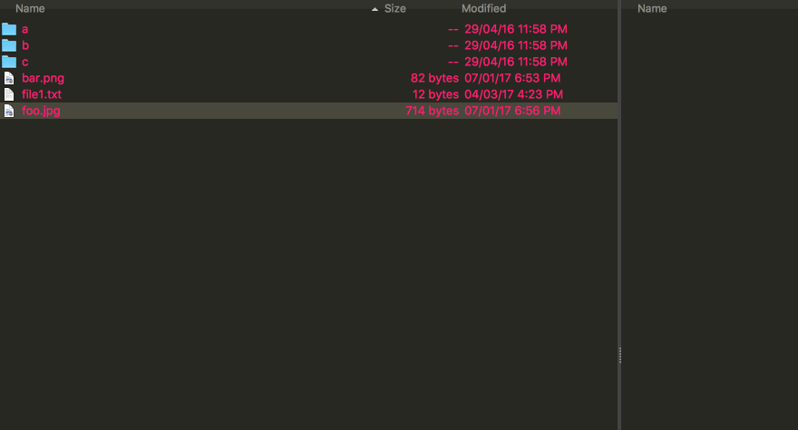
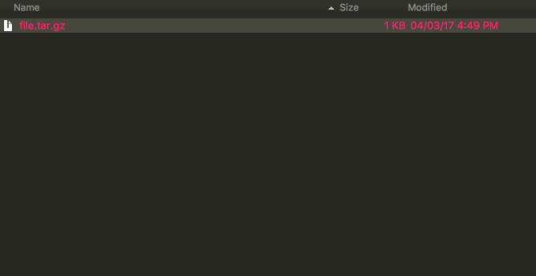

# Tarball

Tarball is plug-in for [fman](https://fman.io/) which allows you to create and 
extract tar files. With this plug-in you can create and extract **.tar, .tar.gz, 
.tar.bz2** and **.tar.lzma** files.

Create:

Extract:

# Installation

On your OS from a terminal window, go to fman's plug-in folder:

Windows: 
> $ cd %APPDATA%\fman\Plugins

Mac: 
> $ cd ~/Library/Application Support/fman/Plugins

Linux: 
> $ cd ~/.config/fman/Plugins

Clone the repo:

> $ git clone https://github.com/umahmood/Tarball.git

# Usage

###### Create tar file:

1. Select desired files
2. Press Shift + x
3. Enter a file name (with extension *.tar or .tar.gz or .tar.bz2 or .tar.lzma) 

Note: when prompted for a filename the extension is important. It determines the 
type of tar file which gets created, entering _myfile.tar.gz_ will create a tar 
file with gzip compression. 

###### Extract tar file:

1. Select tar file
2. Press Shift + x

tar file will be extracted under the current directory.

# License

See the [LICENSE](LICENSE.md) file for license rights and limitations (MIT).
